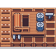
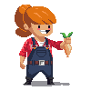

#  GOBLIN CALCULATOR

### *Know your real profit before you list it.*

> **🔒 Privacy Notice:** Goblin Calculator is **100% client-side**. There is **no server or backend** of any kind. This app does **not collect, transmit, or store any data remotely** — everything you enter is saved directly in your **device's local storage** and never leaves your browser.

---

## 📖 About

**Goblin Calculator** is a free, installable web app that helps you work out the *real*  cost and profit of everything you grow, catch, cook, and craft on your farm. Instead of guessing, plug in your boosts, skills, and setup once — and every number across the app updates to match your actual account.

No sign-up. No ads. Just plant your data in and let the goblin do the maths.

---

## ✨ Features

###  Crops,  Fruits &  Greenhouse
- Full profit/cost breakdown for **Basic, Medium, and Advanced** crops
- Fruit tree yields, growth times, and orchard boosts
- Greenhouse produce (Rice, Grape, Olive) cost & yield calculator

###  Resources
- Wood, Stone, Iron, Gold, Crimstone & Oil — yield, recovery time, and tool costs

###  Animals &  Honey
- Chicken, Sheep & Cow product yields and feed costs
- Hives, flowers, and Bee Swarm bonuses

###  Fishing &  Cooking
- Bait & chum cost calculator for every fish tier (Basic / Advanced / Expert)
- Aging Rack & Fermentation Rack costs ( Salt Rake, Baits, Fertilisers)
- Full **cooking XP calculator** — every dish, every fish, with all EXP boosts and skills applied automatically
- Fish Market & Guaranteed Catch support

###  Crop Machine &  Composter
- Seed pack planner with Oil Tank tracking
- Compost Bin / Turbo / Premium Composter output calculator

###  Skills & Ascension
- Full skill tree across every farm category
- Ascension rank support (Rank I / II / III) for upgraded skill effects

###  Boosts & Collectibles
- Wearables, collectibles, BUD NFTs, and seasonal/calendar event boosts
- Everything toggles on/off and instantly recalculates your numbers

###  Live Farm Sync
- Sync your real farm using your Farm ID to auto-fill inventory, plots, and node counts
- Sync live P2P market prices for accurate buy/sell values

###  Betty &  Trade Post
- Coin-conversion planner for Betty's shop
- Track active trades and trade history

###  Installable PWA
- Works fully in the browser
- Add to your phone or desktop home screen for a native app feel — works offline

---

## 🚀 Getting Started

1. Open the app in your browser (or visit the hosted link).
2. Tap **Install** / **Add to Home Screen** for the full app experience.
3. Fill in your Plots & Nodes, toggle your Skills & Boosts, and sync your Farm ID.
4. Browse any tab — Crops, Fishing, Cooking, Animals, and more — to see your real, boosted numbers.

---

## 🛠️ Tech

Built as a lightweight, dependency-free Progressive Web App — plain HTML, CSS, and JavaScript, running entirely client-side with a service worker for offline support.

---

Made with 🌿 for goblins who love a good spreadsheet.

---

`▓▓▒▒░░ POWERED BY CLAUDE ░░▒▒▓▓`

Anthropic's AI — from goblin math to goblin markup

